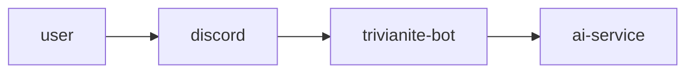
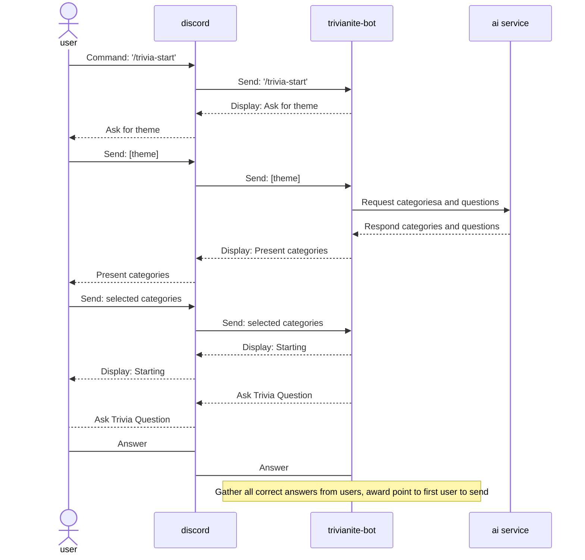

## Systems

```mermaid
flowchart LR
    user --> discord
    discord --> trivianite-bot
    trivianite-bot --> ai-service
```

## Sequence 

```mermaid
sequenceDiagram
actor u as user
participant d as discord
participant tn as trivianite-bot
participant llm as ai service
u ->> d: Command: '/trivia-start'
d ->> tn: Send: '/trivia-start'
tn -->>d: Display: Ask for theme
d -->> u: Ask for theme
u ->> d: Send: [theme]
d ->> tn: Send: [theme]
tn ->> llm: Request categoriesa and questions
llm -->> tn: Respond categories and questions
tn -->> d: Display: Present categories
d -->> u: Present categories
u ->> d: Send: selected categories
d ->> tn: Send: selected categories
tn -->> d: Display: Starting
d -->> u: Display: Starting
tn -->> d: Ask Trivia Question
d --> u: Ask Trivia Question
u -> d: Answer
d -> tn: Answer
note over tn: Gather all correct answers from users, award point to first user to send
```
